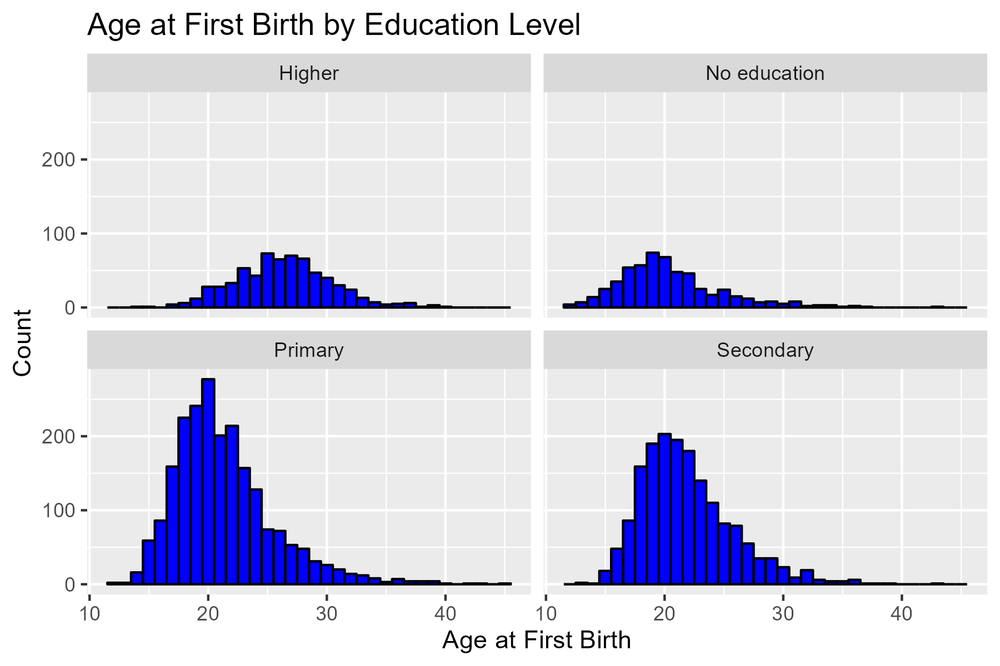
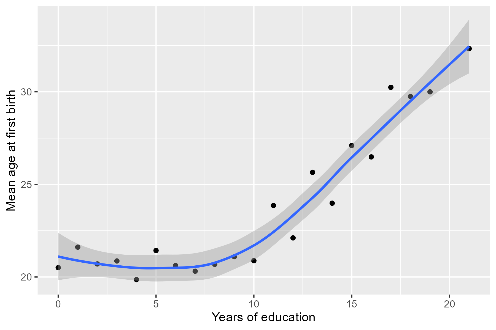
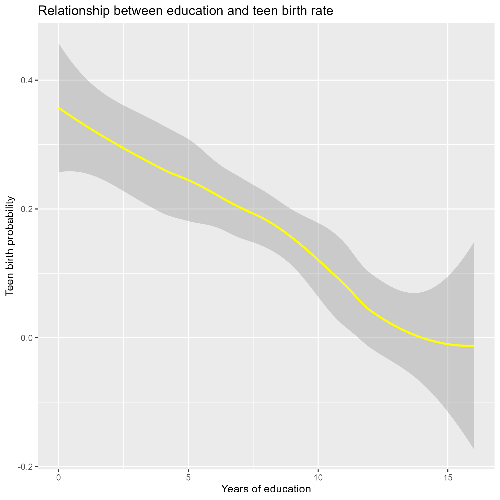
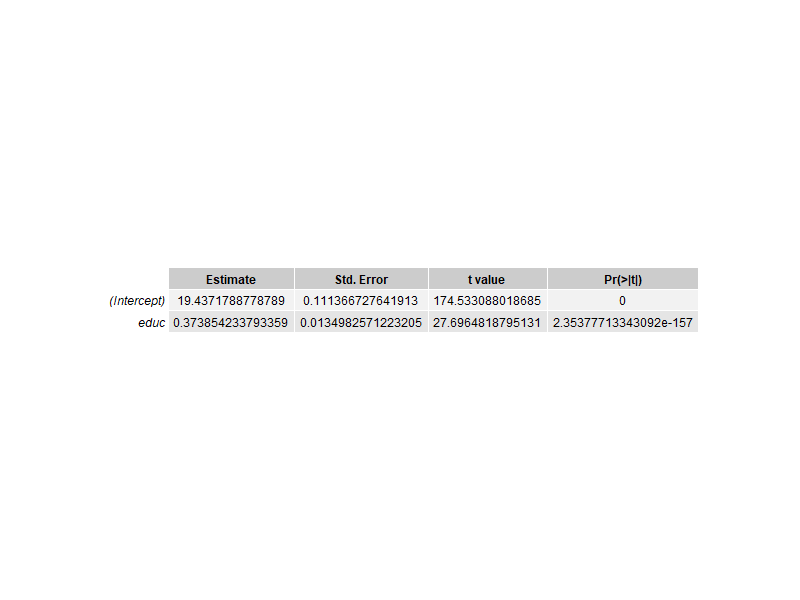
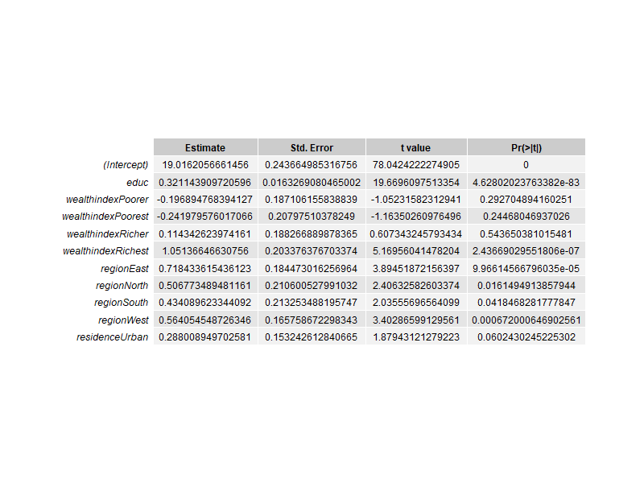

```{r setup, include=FALSE}
knitr::opts_chunk$set(include = FALSE)
```

## 1. Github repository: <https://github.com/tahmisoglu-yigit/R_Project.git>

```{r include=FALSE}
# install.packages("rio")
library(rio)
library(dplyr)
library(tidyverse)
library(ggplot2)
```

```{r include=FALSE}
dropbox <- "https://www.dropbox.com/s/zemcx6rqxsxu9ht/TRIR71.csv?dl=1"
df <- import(dropbox, format = "csv")
```

# 2. Executive summary
In my analysis, I aim to explore the relationship between years of education and teenage motherhood, as well as other background characteristics that may shed light on this relationship. 

To conduct this analysis, I utilize cross-sectional survey data from the 2018 Demographic and Health Surveys for Turkey. This representative household survey provides comprehensive information on birth and individual records for women in each household in developing countries. 

Through the use of simple linear regression and descriptive figures, I have discovered that increased years of education appear to be associated with a decreased likelihood of giving birth as a teenager. Moreover, the probability of teenage motherhood is lower among those in higher wealth categories and those residing in urban regions. However, it is essential to approach these observations with caution, as they do not necessarily indicate causality.

```{r echo=FALSE, fig.height=5, fig.width=5, message=FALSE, warning=FALSE, include = TRUE}




```

# 3. Summary of raw dataset

There are 7346 observations and 5271 variables in the raw dataset. The reason for such high number of variables is that, since this is a survey dataset there are many categorical variables and each unique value, which are answers by respondents, is counted as a separate variable. Each observation is a surveyed women between the ages 15 and 49.

```{r echo=FALSE , message=FALSE, warning=FALSE, include = TRUE}
head(df[, 1:10], n = 10)
cat(paste0("Number of columns: ", ncol(df), " ; Number of rows: ", nrow(df)))
```

# 4. Data cleaning

Firstly, as can be seen above, the variable names are not very descriptive. So, taking the DHS Manual as reference (https://dhsprogram.com/pubs/pdf/DHSG4/Recode7_Map_31Aug2018_DHSG4.pdf), I renamed the variable of interests to make further analyses easier. 
Dataset was mostly clean. Some of the steps I did was to check the data type of variables using str().
I also printed boxplots of certain variables to observe whether there are significant outliers.
Further in the analysis, I removed NA's by "na.rm() = TRUE".
And to make analysis more descriptive, I  recoded unique values of categorical variables among my variable of interests. 

```{r Rename variables, message=FALSE, warning=FALSE, include=FALSE}
df1 <- df |>
  rename(birth_month=V009,
         birth_year=V010,
         age = V012,
         age_5bin = V013,
         region = V024,
         residence = V025,
         educ_level=V106,
         educ = V133,
         wealthindex = V190,
         age_at_birth = V212,
         )
# Recoding unique values of categorical variables
df1$region <- recode(df1$region,
                     "1" = "West",
                     "2" = "South",
                     "3" = "Central",
                     "4" = "North",
                     "5" = "East")
df1$residence <- recode(df1$residence,
                    "1" = "Urban", 
                    "2" = "Rural")
df1$educ_level <- recode(df1$educ_level,
                    "0" = "No education", 
                    "1" = "Primary", 
                    "2" = "Secondary", 
                    "3" = "Higher")
df1$age_5bin <- recode(df1$age_5bin,
                     "1" = "15-19",
                     "2" = "20-24",
                     "3" = "25-29",
                     "4" = "30-34",
                     "5" = "35-39",
                     "6" = "40-44",
                     "7" = "45-49")
df1$wealthindex <- recode(df1$wealthindex,
                     "1" = "Poorest",
                     "2" = "Poorer",
                     "3" = "Middle",
                     "4" = "Richer",
                     "5" = "Richest")

# Keep variable of interests.
df1sub <- select(df1, CASEID, birth_month, birth_year, age, age_5bin, region, residence, educ_level, educ, wealthindex, age_at_birth)
df1sub <- df1sub |>
  drop_na(age_at_birth)

#Check data:
boxplot(df1sub$age_at_birth)
boxplot(df1sub$age)
boxplot(df1sub$educ)
str(df1sub)
```

Below is the subsample with all other variables dropped.
```{r echo=FALSE , message=FALSE, warning=FALSE, include = TRUE}
head(df1sub[, 1:10], n = 10)
cat(paste0("Number of columns: ", ncol(df1sub), " ; Number of rows: ", nrow(df1sub)))
```

# 5. Data exploration, questions you tried to answer, interesting things.

In order to identify women who gave birth as a teenager, I create a binary variable "teenbirth" =1 if age of women at first birth is below 18, and =0 otherwise. Using that, I try to answer the relationship between teenage motherhood and residence type, education level, years of education, and wealth.

```{r include=FALSE}
# Create binary variable representing whether person gave birth as a teenager:
df1sub <- df1sub |>
  mutate(teenbirth = ifelse(age_at_birth < 18, 1, 0))

```

## Percentage of Urban and Rural Residents by Education Level
Below table and figure show that percentage of women who live in urban parts increase with the level of education.
```{r echo=FALSE, message=FALSE, warning=FALSE, include = TRUE}

# Table1: Percentage of Urban and Rural Residents by Education Level
table1 <- table(df1sub$residence, df1sub$educ_level)
(table1 <- prop.table(table1, margin = 2) * 100)

# Figure 1: Percentage of Urban and Rural Residents by Education Level
barplot(table1, beside=TRUE, 
        col=c("blue","grey"), 
        xlab="Education Level", ylab="Percentage", 
        main="Percentage of Urban and Rural Residents by Education Level",
        legend=c("Rural","Urban"))
# png(filename = "residence_educ.png", width = 800, height = 600, res = 300)
ggplot(df1sub, aes(x = educ_level, fill = residence)) +
  geom_bar() +
  labs(title = "Count of Urban and Rural Residents by Education Level")
```

## Teenage motherhood by Wealth Index
Below barplot show us that in Turkey, percentage of women who gave birth as a teenager increases as their economic status decreases.
```{r echo=FALSE, message=FALSE, warning=FALSE, include = TRUE}
# Table2: Teenbirth by Wealth Index
table2 <- table(df1sub$teenbirth, df1sub$wealthindex)
(table2 <- prop.table(table2, margin = 2) * 100)
# Create the bar chart
barplot(table2, beside=TRUE, 
        col=c("green","red"), 
        xlab="Wealth Index", ylab="Percentage", 
        main="Teenbirth by Wealth Index",
        legend=c("No","Teenage motherhood"))
png(filename = "wealth_teenbirth.png", width = 800, height = 600, res = 300)
dev.off()
```

## Age of women at first birth
The distribution of women by their age at first birth is skewed towards left, mainly accumulated between the ages 18 and 23. There is a sharp spike for women at the age of 21. 

```{r echo=FALSE , message=FALSE, warning=FALSE, include = TRUE}
## 2. Age at first birth histogram
(ggplot(data = df1sub,
            mapping = aes(x = age_at_birth) ) + geom_histogram()+
            labs(title = "Age of women at first birth") +
            scale_x_continuous(breaks = unique(df1sub$age_at_birth)))
ggsave("age_firstbirth_hist.png", width = 6, height = 4, dpi = 300)
```

Also we can observe that as level of education increases, age of women at first birth decrease.
```{r echo=FALSE , message=FALSE, warning=FALSE, include = TRUE}
## Average Age at First Birth by Years of Education
(df2 <- df1sub |>
  group_by(educ_level) |>
  summarize(avg_age = mean(age_at_birth, na.rm=TRUE)) |>
  ungroup() |>
  ggplot(mapping = aes(x = reorder(educ_level, avg_age), y = avg_age)) +
    geom_col(fill = "blue") +
    xlab("Education") +
    ylab("Average Age at First Birth") +
    ggtitle("Average Age at First Birth by Education") )
ggsave("age_firstbirth_educ.png", width = 6, height = 4, dpi = 300)

```

```{r echo=FALSE , message=FALSE, warning=FALSE, include = TRUE}
## Average Age at First Birth by Each Level of Education
(df3 <- df1sub |>
  ggplot(mapping = aes(x = age_at_birth)) +
    geom_histogram(binwidth = 1, color = "black", fill = "blue") +
    facet_wrap(~ educ_level, ncol = 2) +
    xlab("Age at First Birth") +
    ylab("Count") +
    ggtitle("Age at First Birth by Education Level"))
ggsave("age_firstbirth_educ_panels.png", width = 6, height = 4, dpi = 300)

```

As years of education increase, per year of education the mean age of women at their first birth also increase.
```{r echo=FALSE , message=FALSE, warning=FALSE, include = TRUE}
## Years of education vs Mean age at first birth
# For full sample
df4 <- df1sub |>
    group_by(educ) |>
    summarize(mean_age_birth = mean(age_at_birth, na.rm = TRUE)) |>
    ungroup()
ggplot(df4, aes(x = educ, y = mean_age_birth)) +
  geom_point() +
  geom_smooth(method = "loess", se = TRUE, level = 0.90) +
  labs(x = "Years of education", y = "Mean age at first birth")
ggsave("age_firstbirth_educ_loess.png", width = 6, height = 4, dpi = 300)

```
## Regional distribution: There are no significant differences between regions for mean age of women at first birth.
```{r echo=FALSE , message=FALSE, warning=FALSE, include = TRUE}
# Plot the mean age at first birth for each region
mean_age <- aggregate(age_at_birth ~ region, data = df1sub, FUN = mean)
ggplot(mean_age, aes(x = region, y = age_at_birth)) +
  geom_bar(stat = "identity") +
  ylim(0, max(df1sub$age_at_birth)) +
  labs(x = "Region", y = "Mean Age at First Birth", title = "Mean Age at First Birth by Region")
ggsave("region_birthage.png", dpi = 300)
```

## Regression results:
Models show positive significant relationship between years of education and age at first birth. As we add more controls, R-squared value improve slightly.

```{r echo=FALSE, message=FALSE, warning=FALSE, include = TRUE}



```

```{undefined echo=FALSE}
model1 <- lm(age_at_birth ~ educ, data = df1sub)
summary(model1)
model2 <- lm(age_at_birth ~ educ + wealthindex + region + residence, data = df1sub)
summary(model2)
```

## 6. Explain part of code: 

```{r echo=FALSE, message=FALSE, warning=FALSE, include = TRUE}

```


```{r echo=TRUE, message=FALSE, warning=FALSE}

df2 <- df1sub |>
  group_by(educ_level) |> # group individuals by their level of education
  summarize(avg_age = mean(age_at_birth, na.rm=TRUE)) |> # take average age at first birth per level of education
  ungroup() |> # pipeline to generate plot
  ggplot(mapping = aes(x = reorder(educ_level, avg_age), y = avg_age)) + # sort in ascending order
    geom_col(fill = "blue") +
    xlab("Education") + #labelling
    ylab("Average Age at First Birth") +
    ggtitle("Average Age at First Birth by Education") # adding title
```
